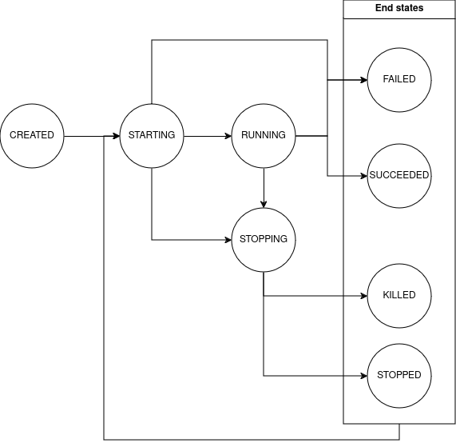

# taskmaster
Processes monitoring tool with an interactive shell and a daemon.

task statuses:
- CREATED
- STARTING
- RUNNING
- SUCCEEDED
- FAILED
- STOPPING
- STOPPED
- KILLED
- RESTARTING # on a fail, freeze or as a request
- MIXED # > than one process

